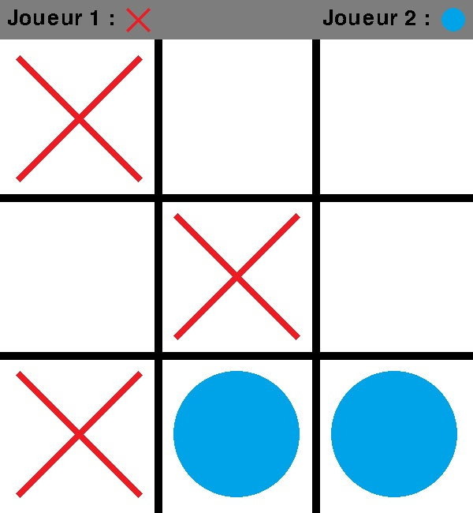

# Python-Morpions-Game

this a a reproduction of the classic board game "Noughts and Crosses".
## Features
- Player versus player
- Player versus AI
## Installation
1. Download the repository by clicking on `Code > Download ZIP`
2. Extract the ZIP file
3. Run `main.pyw`
## Requirements
- Python 3.7
- Python pygame library
- Python random library